# Cocktail GPT

AI-powered cocktail recommendation agent built with LangGraph and Next.js. Personalizes suggestions using Spotify listening data, weather, and a user taste profile built up over time.

## Architecture

```mermaid
flowchart TD
    User([User]) --> NextJS

    subgraph NextJS [Next.js Frontend]
        ChatUI[Chat UI]
        SpotifyUI[Spotify Connect]

        ChatUI -->|POST /api/chat| NChat[route: /api/chat]
        SpotifyUI -->|GET| NSpotify[routes: /api/spotify/*]
    end

    subgraph Backend [FastAPI Backend]
        subgraph Routes [API Routes]
            RChat[POST /v1/chat]
            RSpotifyURL[GET /api/spotify/connect-url]
            RSpotifyCB[GET /api/spotify/callback]
            RSpotifyStatus[GET /api/spotify/status]
            RSpotifyDisconnect[DELETE /api/spotify/disconnect]
        end

        subgraph Services [Services]
            SChatSvc[chat_service]
            SSpotifyAuth[spotify_auth_service]
            SResponseBuilders[response_builders]
            SStreamingUtils[streaming_utils]
        end

        subgraph Graph [LangGraph Main Graph]
            Supervisor[supervisor]

            subgraph SGRec [recommendation subgraph]
                Ingest[ingest]
                ProfileBuilder[profile_builder]
                PrefExtractor[preference_extractor]
                ConstraintChecker[constraint_checker]
                Recommender[recommender]
                Clarify{clarify?}
                OutputRec[output]

                Ingest --> ProfileBuilder --> PrefExtractor --> ConstraintChecker --> Recommender
                Recommender -->|confidence low| Clarify
                Clarify -->|resume| Recommender
                Recommender -->|confidence ok| OutputRec
            end

            subgraph SGProfile [profile_management subgraph]
                ProfileUpdater[profile_updater]
            end

            subgraph SGRate [rate_cocktail subgraph]
                RateCocktail[rate_cocktail]
                OutputRate[output]
                RateCocktail --> OutputRate
            end

            subgraph SGExplain [explain_recommendation subgraph]
                ExplainRec[explain_recommendation]
                OutputExplain[output]
                ExplainRec --> OutputExplain
            end

            subgraph SGBrowse [browse_by_attribute subgraph]
                BrowseAttr[browse_by_attribute]
            end

            subgraph SGRestrict [manage_restrictions subgraph]
                ManageRestrictions[manage_restrictions]
            end

            subgraph SGRetrieve [retrieve_profile subgraph]
                RetrieveProfile[retrieve_profile]
                OutputRetrieve[output]
                RetrieveProfile --> OutputRetrieve
            end

            subgraph SGFallback [conversational_fallback subgraph]
                ConvFallback[conversational_fallback]
                OutputFallback[output]
                ConvFallback --> OutputFallback
            end

            subgraph SGSelf [self_information subgraph]
                SelfInfo[self_information]
                OutputSelf[output]
                SelfInfo --> OutputSelf
            end

            Supervisor -->|recommendation| SGRec
            Supervisor -->|profile_update| SGProfile
            Supervisor -->|rate_cocktail| SGRate
            Supervisor -->|explain_recommendation| SGExplain
            Supervisor -->|browse_by_attribute| SGBrowse
            Supervisor -->|manage_restrictions| SGRestrict
            Supervisor -->|retrieve_profile| SGRetrieve
            Supervisor -->|conversational_fallback| SGFallback
            Supervisor -->|self_information| SGSelf
        end

        subgraph Tools [Ingest Tools]
            TSpotify[spotify]
            TWeather[weather]
            TCocktailKB[cocktail_kb]
        end
    end

    NChat --> RChat
    NSpotify --> RSpotifyURL & RSpotifyCB & RSpotifyStatus & RSpotifyDisconnect

    RChat --> SChatSvc
    RSpotifyURL & RSpotifyCB & RSpotifyStatus & RSpotifyDisconnect --> SSpotifyAuth

    SChatSvc --> Supervisor
    SChatSvc --> SStreamingUtils
    SChatSvc --> SResponseBuilders

    Ingest --> TSpotify & TWeather & TCocktailKB
```

## Stack

- **Frontend**: Next.js, NextAuth (Google), Tailwind CSS
- **Backend**: FastAPI, LangGraph, LangChain, SQLite (checkpointer)
- **Auth**: Google OAuth (NextAuth) + Spotify OAuth
- **AI**: Claude (Anthropic) via LangChain
